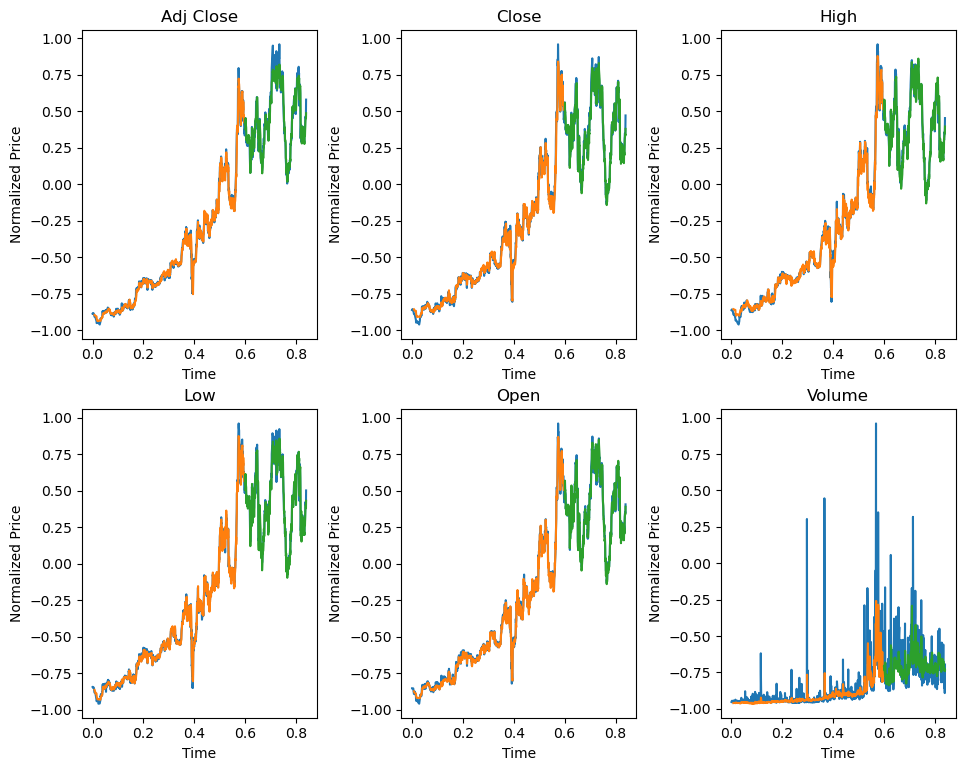

# Trabalho de ML

Trabalho de Machine Learning buscando prever preços de ações da bolsa usando redes neurais.

O modelo foi treinado para prever os preços de alta, baixa, abertura, fechamento, fechamento ajustado e a quantidade do volume diários da ação:

Mais detalhes no [notebook do trabalho](Trabalho.ipynb).
